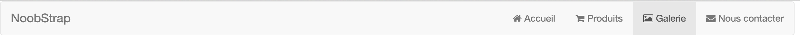
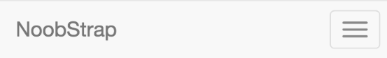
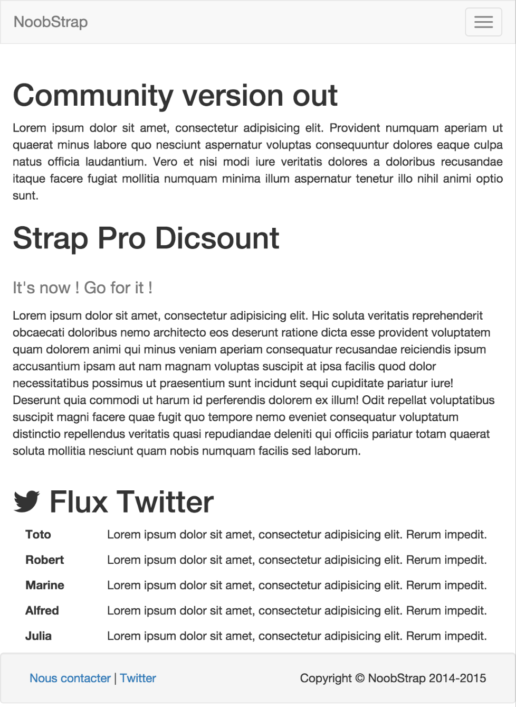
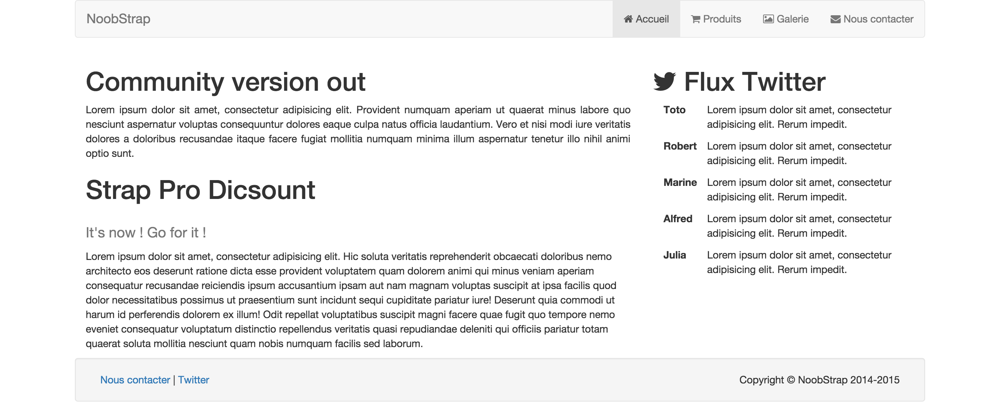
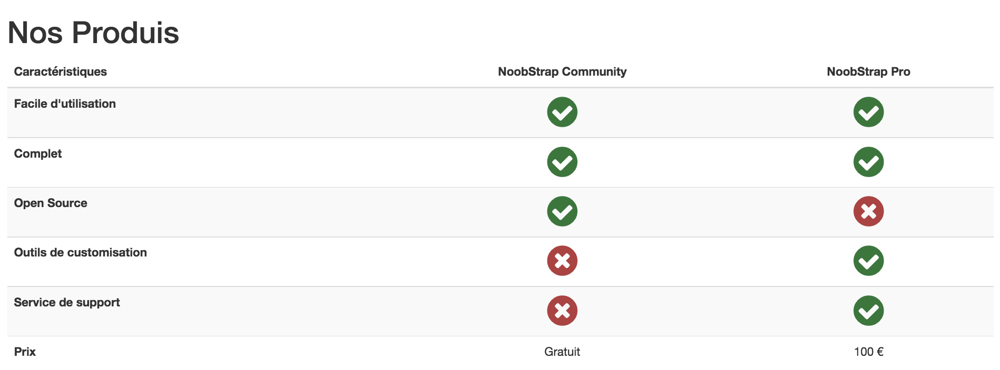
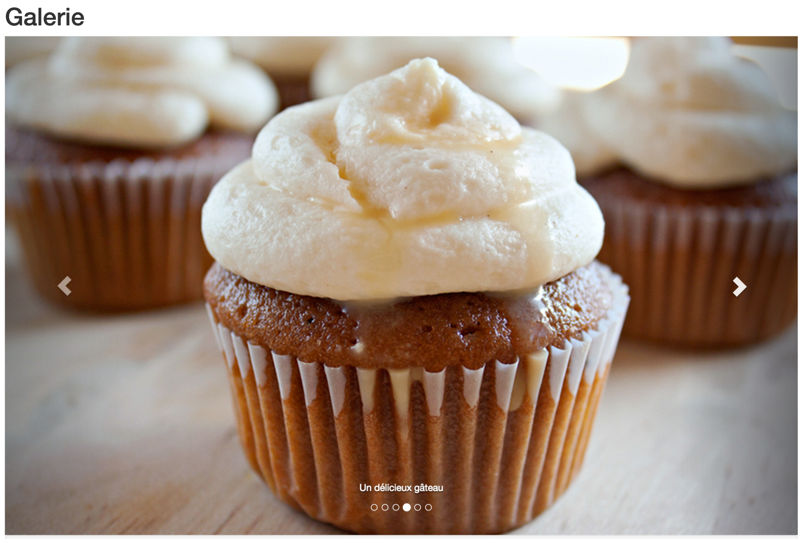
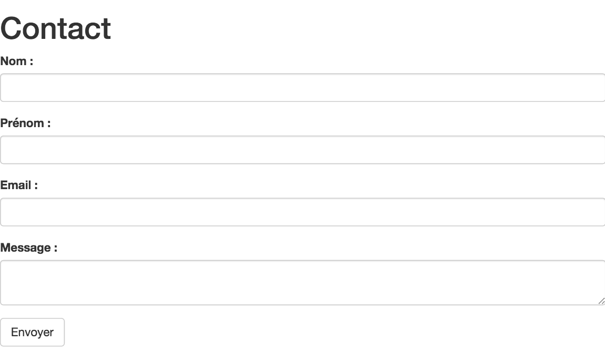
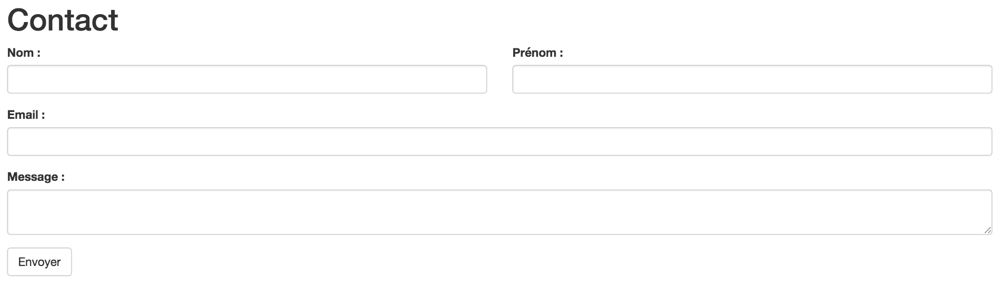

TP 2 Bootstrap
==============

Le principe du tp ici est d'approfondir la découverte de bostrap. Ainsi de commencer à être à votre aise avec l'outil.
Nous allons voir les points suivants :

1. Mise en place d'une navbar boostrap simple permettant d'avoir un menu "sandwich" Automatiquement
2. Jouer un avec le positionnement
3. Utiliser les tableaux bootstrap
4. Faire un slider avec bootstrap
5. Faire un formulaire avec bootstrap
6. Intégrer un template bootstrap simple
7. Bonus : tester un slider avec thumbnail

Lors de ce TP vous n'écrirez pas une ligne de CSS. Tous le CSS est déjà écrit. (Il y a 3 lignes pour la galerie)
(Pour la partie bonus, il y a quelques lignes en plus)
Le but étant de vous pousser à lire la documentation bootstrap et à chercher un peu tout ce que l'on peut faire avec.

> Attention : Toute la partie bootstrap/JQuery est intégrée par CDN si vous voulez les utiliser sans internet il vous faudra d'abord les télécharger. Et biensur changer le code correspondant.

# 1. La navbar
*A faire sur toutes les pages.*

Prenez le temps de regarder la documentation sur bootstrap : [Navbar](http://getbootstrap.com/components/#navbar)

Une version un peu simplifiée de l'exemple bootstrap :
```html
<nav class="navbar navbar-default" role="navigation">
  <div class="container-fluid">
    <div class="navbar-header">
      <button type="button" class="navbar-toggle collapsed" data-toggle="collapse" data-target="#menu-nav">
        <span class="sr-only">Basculer Menu</span>
        <span class="icon-bar"></span>
        <span class="icon-bar"></span>
        <span class="icon-bar"></span>
      </button>
      <a class="navbar-brand" href="#">Mon Site</a>
    </div>
    <div class="collapse navbar-collapse" id="menu-nav">
      <ul class="nav navbar-nav">
        <li class="active"><a href="#">Un liens</a></li>
        <li class="dropdown">
          <a href="#" class="dropdown-toggle" data-toggle="dropdown" role="button" aria-expanded="false">Un sous menu <span class="caret"></span></a>
          <ul class="dropdown-menu" role="menu">
            <li><a href="#">Un autre lien</a></li>
          </ul>
        </li>
      </ul>
    </div>
  </div>
</nav>
```

Le résultat attendu sur tablette/écran :


Sur mobile :


> Attention : Ce composant bootstrap nécessite la partie JS même si ce n'est pas écrit dans la documentation.

# 2. Positionnement de la page d'accueil
*A faire sur l'index*
Ici un peu comme dans le positionnement du TP précédent, vous allez essentiellement utiliser les classes :
* .row
* .col-xs-n .col-sm-n .col-md-n et .col-lg-n où "n" est un nombre entre 1 et 12.

Vous pouvez lite la documentation bootstrap ici : [Grille](http://getbootstrap.com/css/#grid)

Résultat attendu mobile et tablette (attention le menu n'est pas le même en version tablette):


Sur bureau et grande tablette :


Pour le footer essayez de trouver la solution en fouinant un peu sur le site de bootstrap.
*A faire sur toutes les pages*

>Pour rappel : Toute la page est faisable sans le moindre CSS écrit de votre part.

# 3. Les tableaux bootstrap
*A faire sur la page produits*

Lors de cette partie vous mettrez en forme un tableau. Il n'y aura pas grande différence entre la version mobile et la version bureau.
Juste une petite subtilité, si jamais votre tableau venait à être trop grand pour le support.

La documentation pour les tableaux : [Tableaux](http://getbootstrap.com/css/#tables)

Le résultat attendu :


On ne le voit pas sur la capture mais la couleur des lignes change au survol.

# 4. Un slider
*A faire sur la page gallery*

Bootstrap fournis un slider : [Slider/Carousel](http://getbootstrap.com/javascript/#carousel)

A vous de mettre en place un slider à partir des images fournies. Comme précédemment pas grande différence entre les différentes versions.

Résultat attendu :


# 5. Un formulaire
*A faire sur la page contact*

Bootstrap fournis tout un tas d'outils pour les formulaires. Prennez le temps d'y jetter un coup d'oeil : [Formulaire](http://getbootstrap.com/css/#forms)

Résultat attendu mobile :


Pour tablette et plus :


# 6. Intégrer un template simple
*A faire sur toutes les pages*

Le net est rempli d'une quantité hallucinante de tempalte pour bootstrap. Cela permet d'avoir assez vite des choses qui présente bien.
Aprés à vous de commencer à personnaliser, au fil du temps les choses de façon à coller davantage à l'identité du site.
Dans le cas d'une admin un bootstrap nu ou avec un template est une solution parfaite.

Un coin avec pas mal de theme simple (majoritairement des changements de couleur) : [bootswatch](http://bootswatch.com/)
Pour les versions prêtes à l'utilisation : [CDN bootswatch](http://bootstrapcdn.com/#bootswatch_tab)

Copiez le lien du thème que vous voulez tester, placez le dans vos pages et c'est parti !

Voilà vous venez de finir la partie découverte de Bootstrap.

-------------------------------------------------------------------------------------------------------

S'il vous reste du temps voici la partie bonus :

# 7. Customiser la gallerie
*A faire sur la gallerie*

Comme vous l'avez sûrement vu dans la CSS fournis avec l'exercice, il y a des choses liées au slider.
Ajoutez la classe carousel-thumbnail à votre slider et placez les thumbnails fournis dans le dossier images dans votre listes carousel-indicators et c'est parti un petit slider avec aperçu.
Bon le code est pas nikel mais cela donne une impression de ce que l'on peut faire avec bootstrap.

Ce que cela devrait donner :
screenshots/gallery-extra.png

# 8. A vous de jouer !

S'il vous reste encore du temps, regardez ce qu'il y a sur bootstrap et tentez de modifier votre code.
